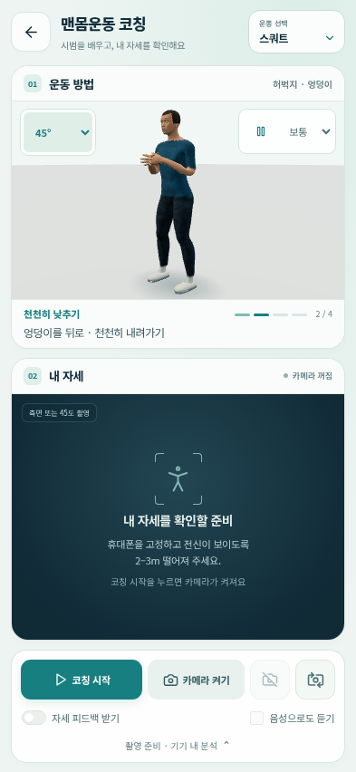

# Synex Health 수정판 1.3.motion

[Android APK 다운로드](https://github.com/hundol047/Synex-Health/raw/refs/heads/synex-apk-motion-ui-20261008/Synex-Health-motion-ui.apk) · [설치 QR](https://raw.githubusercontent.com/hundol047/Synex-Health/synex-apk-motion-ui-20261008/Synex-Health-install-QR.png)

기존 `Synex Health 수정판`을 유지한 채 업데이트 설치하세요. 설치 후 앱 아이콘을 눌러 실행합니다. 앱 ID와 서명은 이전 수정판과 같습니다. QR은 APK 다운로드 주소를 엽니다.

맨몸운동 7종의 발·손 지지, 런지 발 이동, 몸통 정렬과 동작 속도를 개선했습니다. 홈 바로가기, 코칭 단계 안내, 44px 조작 버튼과 바닥 운동 시연의 별도 조작줄을 적용했습니다. 세로 화면은 위 시연·아래 카메라를 같은 크기로 표시하고 짧은 가로 화면은 나란히 표시합니다. 기존 반투명 체성분 마네킹과 기기 내 암호화 저장소를 포함합니다.

브라우저에서 개인용 기능·작은 화면·오프라인 조작을 확인하고 APK의 서명, 모델 체크섬, 개인용 설정과 199개 웹 자산을 대조했습니다. 실제 사용자 휴대폰에서 직접 실행한 검증은 아닙니다. 운동은 작성된 시범 동작이며 전문가 모션 캡처 또는 임상 검증 자료가 아닙니다.

Source: `bfd54cad7df52bc89a13411a55cd1873d29523d6`. Package/version and checksums: [VERIFICATION.json](VERIFICATION.json), [SHA256SUMS](SHA256SUMS).

