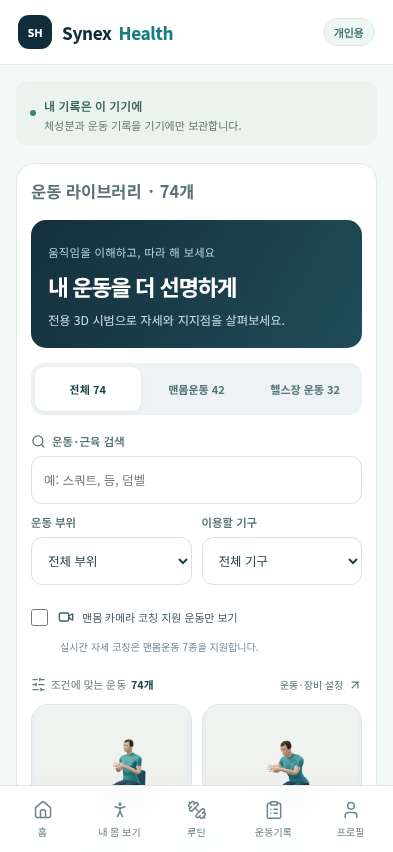
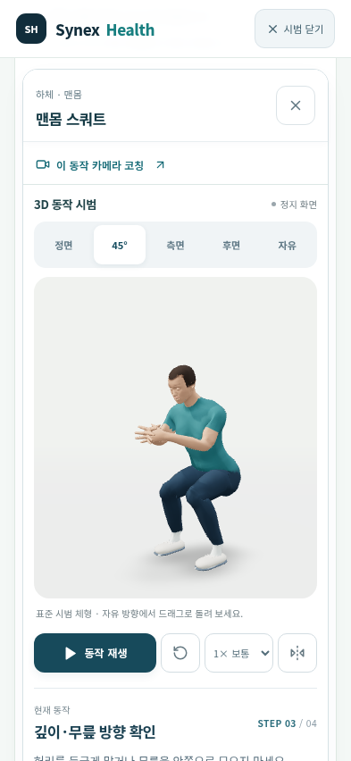

# Synex Health 수정판 1.5.studio

[Android APK 다운로드](https://github.com/hundol047/Synex-Health/raw/refs/heads/synex-apk-studio-polish-20261008/Synex-Health-studio.apk) · [설치 QR](https://raw.githubusercontent.com/hundol047/Synex-Health/synex-apk-studio-polish-20261008/Synex-Health-install-QR.png)

기존 `Synex Health 수정판`을 유지한 채 업데이트 설치하세요. 앱 ID와 서명은 기존 수정판과 같고 버전 코드를 올렸습니다. QR은 APK 다운로드 주소를 엽니다. 설치 후 앱 아이콘으로 실행하세요.

74종의 3D 시범을 추가로 다듬었습니다. 둥근 목선·상완 방향의 소매, 피부와 운동복 색상 분리, 로컬 피부·직물·머리카락 질감과 밉맵 필터링을 적용했습니다. 중립적인 스튜디오 조명, 선명한 그림자와 렌더링 해상도를 높였습니다. 걷기·활기찬 걷기의 팔과 다리는 반대 위상으로 움직이고, 착지를 부드럽게 했습니다. 지지하지 않는 손은 가볍게 굽힙니다. 휴대폰의 제목 높이와 여백을 줄이고 재생 간격을 보정했습니다. 맨몸운동 42종과 기구 운동 32종, 총 74종에 개별 3D 동작을 적용했습니다. 고정된 관절 길이, 손발의 지지, 좌우 교대, 실제 손가락 쥐기와 덤벨·바벨·머신·케이블·페달·발판을 반영했습니다. 전체 동작과 기구가 들어오는 운동별 구도, 로컬 스튜디오 조명, 의상·피부·머리카락 재질을 개선했습니다. 목록은 실제 3D 시범 이미지 74장을 번들로 표시하며 선택한 운동 하나만 3D로 렌더합니다. 운동별 단계 안내, 방향·속도·구간·좌우 반전을 지원합니다.

카메라 자세 분석은 맨몸운동 7종을 지원합니다. 74종 모두 카메라로 분석한다는 의미는 아닙니다. 개인 체성분 마네킹과 기기 내 암호화 저장소는 포함되어 있습니다. 로그인·서버·외부 모델 다운로드 없이 개인용으로 실행합니다.

실제 모바일 브라우저 WebGL로 74종의 세 구간(222장)을 캡처하고, 관절·피부·신발·손바닥·벤치 지지와 반복 연속성, 구도를 검사했습니다. APK의 앱 ID·서명·버전·개인용 설정·모델 체크섬과 전체 웹 자산도 대조했습니다. 실제 Android 휴대폰에서 직접 실행한 검증은 아니며, 작성된 자세 이해용 시범으로 전문가 모션 캡처나 임상 검증 자료가 아닙니다.

Source: `280398b19bf4de160870fb09523a579a919cb433`. 검사와 체크섬: [VERIFICATION.json](VERIFICATION.json), [SHA256SUMS](SHA256SUMS). 구현 설명: [운동 시범](docs/EXERCISE_STUDIO.md).

