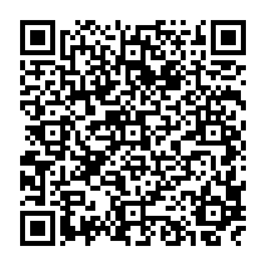

# Synex Health 수정판 설치 파일

[수정 APK 다운로드](https://github.com/hundol047/Synex-Health/raw/refs/heads/synex-apk-storagefix-20261008/Synex-Health-storagefix.apk)

QR을 스캔하면 APK 설치 파일을 받는 주소가 열립니다. 다운로드한 APK를 열어 설치하세요.

- 파일: `Synex-Health-storagefix.apk` (약 27 MB)
- 앱 이름: **Synex Health 수정판**
- 앱 ID: `com.synex.health.personal.storagefix`
- 버전: `1.0.storagefix` / `2026100701`
- 기존 앱과 별도로 설치됩니다. 기존 앱의 기록은 자동 이전되지 않습니다.

프런트엔드 테스트 218개와 개인용 브라우저 E2E 3개는 통과했습니다. Android 에뮬레이터에서는 기본 WebView 샘플도 렌더러 오류로 중단돼, 실제 Android 홈 진입 검증은 완료하지 못했습니다. [검증 기록](VERIFICATION.md)을 확인하세요.

`SHA256SUMS`는 설치 파일의 무결성 확인용입니다. `SOURCE.patch`는 원본 브랜치 커밋 `13396463051db5a3d4e3a506df6267e133fca682`에 대한 수정 내역입니다.
