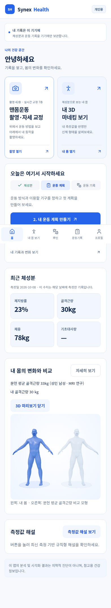
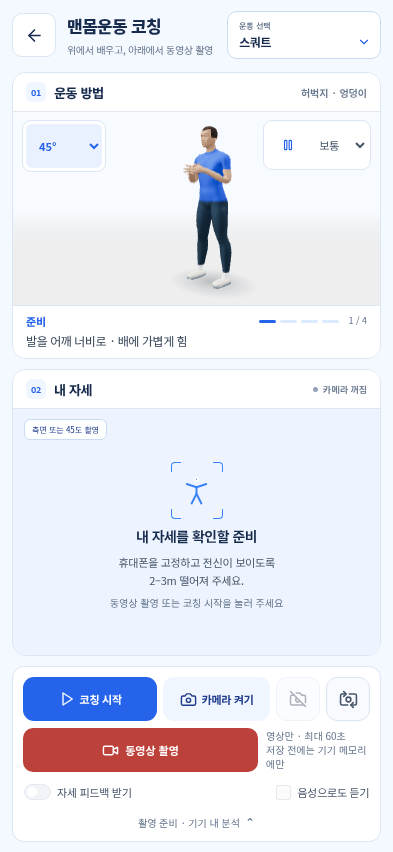
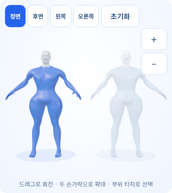
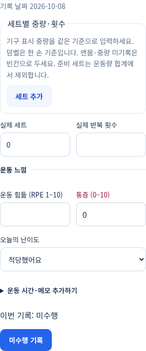

# Synex Health 수정판 1.7.blue-white

[Android APK 다운로드](https://github.com/hundol047/Synex-Health/raw/refs/heads/synex-apk-blue-white-20261008/Synex-Health-blue-white.apk) · [설치 QR](https://raw.githubusercontent.com/hundol047/Synex-Health/synex-apk-blue-white-20261008/Synex-Health-install-QR.png)

기존 `Synex Health 수정판`을 유지한 채 업데이트 설치하세요. 앱 ID와 서명은 기존 수정판과 같고 버전 코드를 올렸습니다. QR을 찍으면 APK 다운로드 주소가 열립니다. 설치 후 앱 아이콘으로 실행하세요.

화면을 파란색·흰색 중심으로 정리했습니다. 흰색 배경, 가벼운 파란색 테두리와 버튼으로 홈·운동 촬영·신체 비교·운동 기록을 통일하고, 진한 청록색과 무거운 그라데이션을 줄였습니다. 운동 동영상 촬영과 기록 정렬, 벽 접촉 수정은 그대로 포함합니다.

맨몸운동 42종에서 위쪽의 3D 운동 방법을 보며 아래쪽 카메라로 실제 동영상을 촬영할 수 있습니다. 촬영 시작·종료, 촬영본 재생, 저장·공유·삭제를 추가했습니다. 기기에 지원되는 MP4를 우선 선택하며, 지원하지 않으면 WebM을 사용합니다. 동영상은 카메라 원본이며 화면의 분석 선이나 3D 시범은 촬영본에 합성하지 않습니다. 실시간 스켈레톤 자세 분석은 스쿼트·런지·사이드 런지·푸시업·플랭크·힙 힌지·글루트 브리지 7종을 지원하며, 나머지 35종은 촬영 및 시범을 제공합니다. 마이크는 사용하지 않습니다. 녹화는 최대 60초 또는 약 20MiB까지이며, 운동 전환·백그라운드 이동·카메라 종료 시 진행 중인 촬영을 정리합니다. 사용자가 저장·공유를 누르기 전에는 촬영본을 내보내지 않습니다. Android 10 이상에서는 명시적 저장 시 `다운로드/Synex Health`에 저장하며, Android 8–9와 공유 버튼에서는 기기의 파일 저장·공유 선택 창을 엽니다. 자동 업로드는 없습니다.

운동 기록은 수동 기록, 운동 진행 중 세트 기록, 기존 세트 수정에서 모두 힘듦을 왼쪽, 통증을 오른쪽에 같은 높이로 맞췄습니다. 힘듦 입력이 접힌 추가 정보 속에 숨지 않습니다. 기존 기록, 자동 저장 및 통증에 따른 운동 중지 처리를 유지했습니다.

벽 푸시업·좁은 벽 푸시업·종아리 스트레칭·벽 힙 힌지·월싯 5종의 벽 접촉을 수정했습니다. 관절만 보는 대신 손가락, 머리, 의상까지 포함한 실제 3D 신체 표면을 검사하고, 체형별로 고정된 벽의 접촉면을 맞춥니다. 벽 푸시업에서 머리가 벽을 통과하는 문제와 벽을 지지하는 손·등·둔부의 교차를 바로잡았습니다.

내 몸과 문헌 평균 골격근량 비교 모형을 실제 3D로 나란히 표시합니다. 내 몸은 선명한 파란색에 불투명도 0.66(투명도 34%), 평균 비교 모형은 연한 파란색에 불투명도 0.22(투명도 78%)를 적용해 두 몸을 쉽게 구분합니다. 투명도 값을 올리면 몸이 더 투명해집니다. 앞·뒤·좌우 방향에서도 두 모형이 서로 가리지 않도록 배치했습니다. 평균 수치는 Janssen 등(2000)의 성인 MRI 연구와 공개 인용 자료를 사용한 남성 33kg·여성 21kg이며, 앱에서 출처와 비교 조건을 표시합니다. 비교에는 성별, 생년월일(18–88세 범위), 키·체중·체지방률·골격근량이 필요합니다. 필요한 정보가 없거나 비교 수치가 입력된 제지방량보다 크면 이유와 입력 화면을 안내합니다. 평균 모형은 입력된 키·체중·체지방률을 유지하고 골격근량을 문헌 평균으로 바꾼 비교용 모형이며, 인구 전체의 평균 체형이나 임상 진단 모형이 아닙니다.

총 74종(맨몸 42종·기구 32종)의 개별 3D 운동 시범, 운동별 단계 안내, 방향·속도·구간·좌우 반전과 로컬 썸네일을 제공합니다. 로그인·서버·외부 모델 다운로드 없이 개인용으로 실행하며, 개인 기록은 기기 내 암호화 저장소를 사용합니다.

검증: 전체 프런트엔드 단위 테스트 380개(66개 파일), 최종 개인용 배포 브라우저 테스트 22개를 통과했습니다. 실제 모바일 브라우저 WebGL에서 74종의 세 구간(222장)을 캡처하고 파일 해시를 대조했습니다. 실제 MediaRecorder 동영상의 촬영·종료·재생·다운로드와 취소 동작, 기록 저장·재실행 복원, 두 실제 3D 비교 표면과 투명도·방향·작은 화면 배치를 검사했습니다. APK의 앱 ID·서명·버전·개인용 설정·포즈 모델 체크섬과 전체 웹 자산을 대조하고, 커스텀 `VideoRecordingPlugin`이 APK DEX에 포함되어 `MainActivity`에서 등록된 것을 확인했습니다. 실제 Android 휴대폰에서 카메라 권한, 네이티브 저장·공유, 렌더링 성능을 직접 확인한 검증은 아닙니다.

Source: `5e610a2e0bce4613743627675b6ad1a621b5350f`. 검사와 체크섬: [VERIFICATION.json](VERIFICATION.json), [SHA256SUMS](SHA256SUMS). 구현 설명: [운동 시범](docs/EXERCISE_STUDIO.md), [카메라 운동](docs/BODYWEIGHT_POSE_COACH.md).

